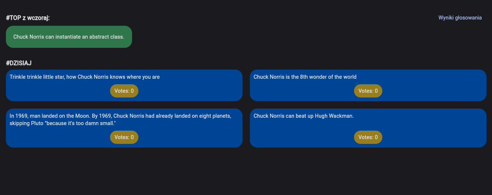
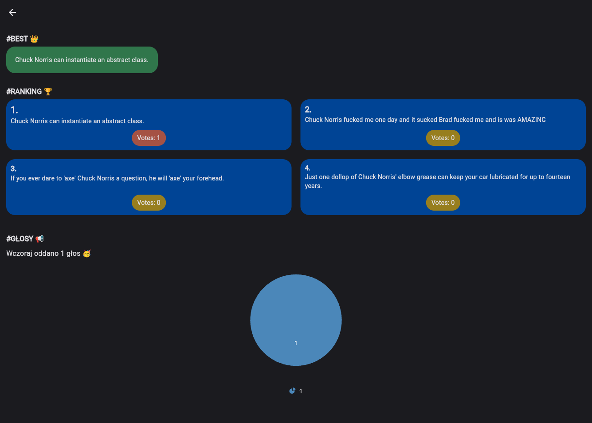
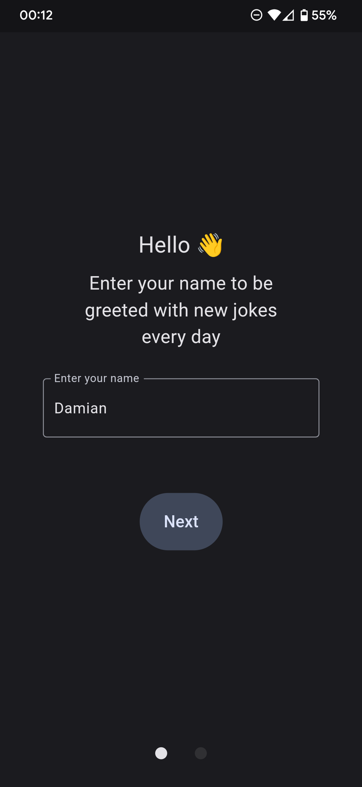
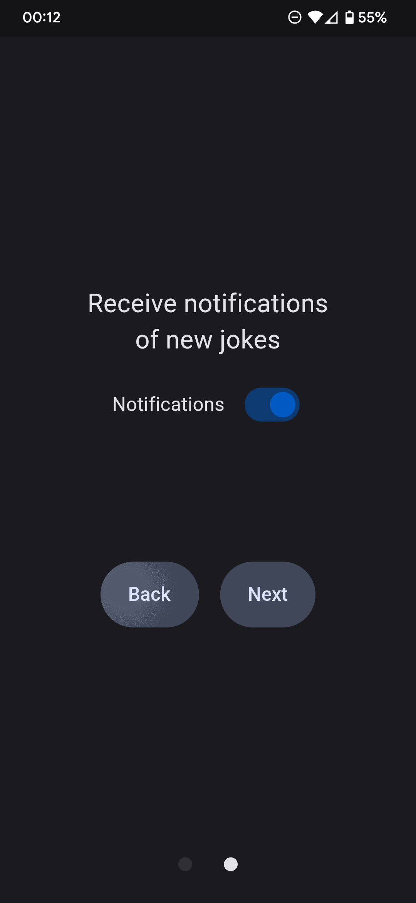
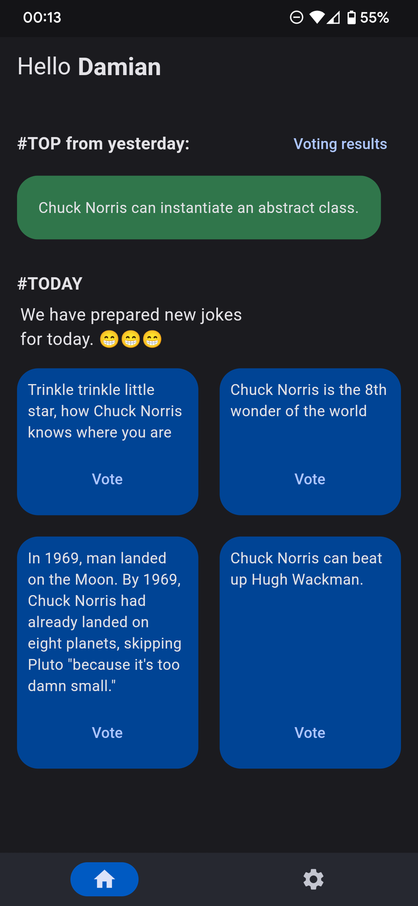
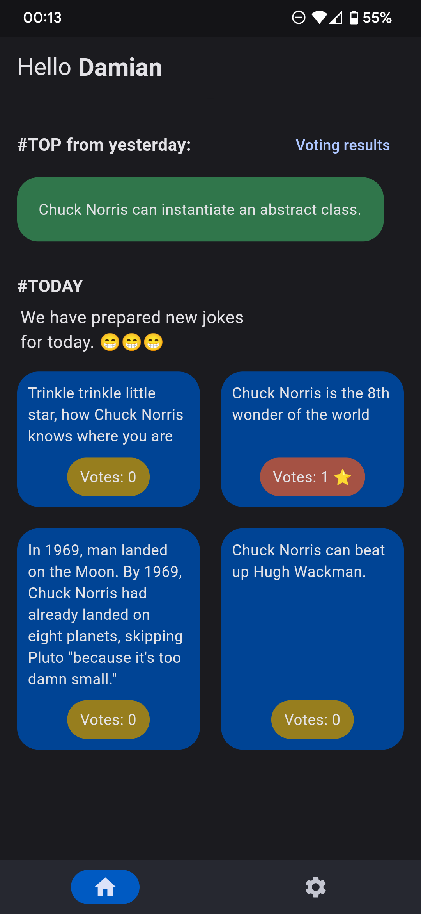
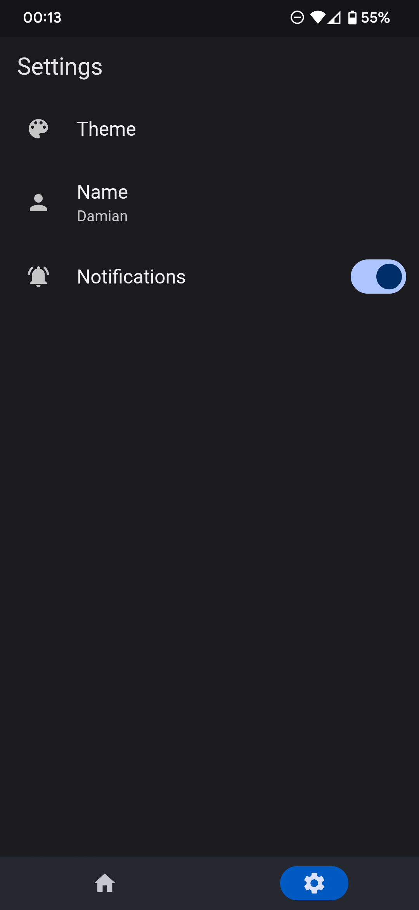
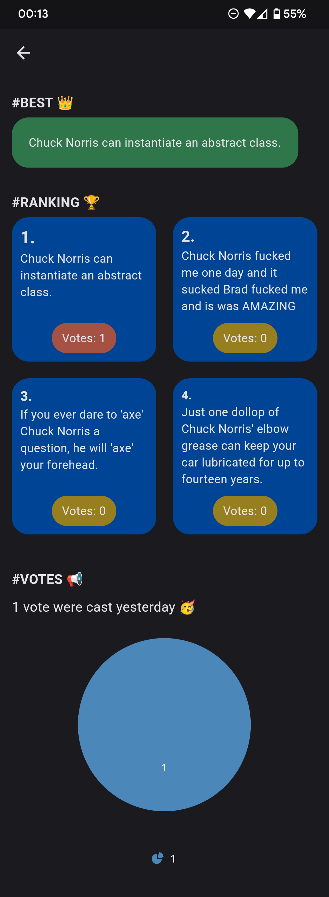

# Jokes Mobile App

Mobile application for voting for the best joke for today, and also allows you to view the voting results from the previous day.
The data is downloaded from an external API, which contains the logic of drawing jokes for a given day, handling vote counting and sending a daily notification with information about a new vote.

## Features

- Displaying the previous day's best joke and voting statistics
- Voting for the best joke for today and previewing the number of votes after voting
- Ability to enable daily notifications of a new vote available(and the completion of the previous vote)
- Entering a username that is visible on the welcome screen
- Changing the Light/Dark theme
- Configuration screen that asks the user to enter their name, as well as their notification preferences
- Browser view - only preview of today's and yesterday's voting statistics

## Demo

[Web](https://jokes.damianhoppe.pl)

## Run

To run the application, you need to configure the Firebase project to handle notifications (Firebase Messaging Cloud).

```sh
# Clone the project:
git clone https://github.com/damianhoppe/JokesMobileApp.git
cd JokesMobileApp

# Running the application:
flutter run --dart-define=FCM_API_KEY=... --dart-define=FCM_APP_ID=... --dart-define=FCM_MESSAGING_SENDER_ID=... --dart-define=FCM_PROJECT_ID=... [--release]
```

## Screenshots

### Web




### Android










